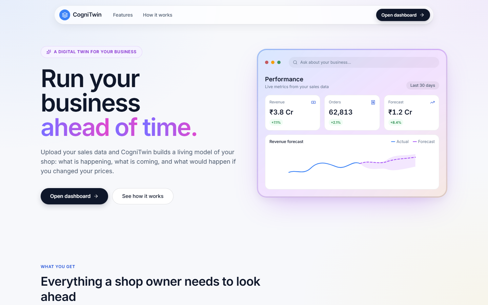
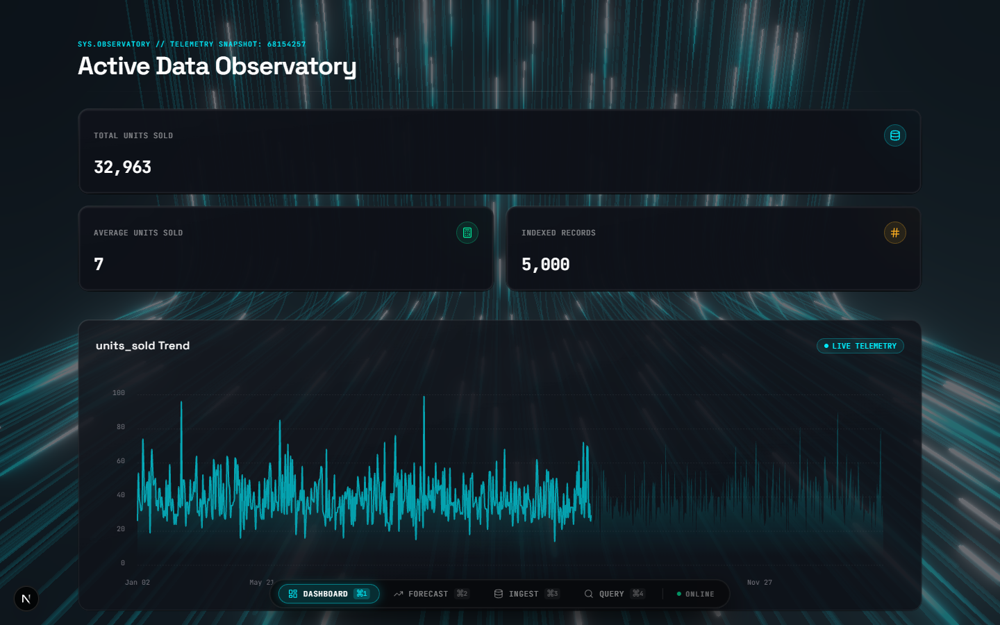
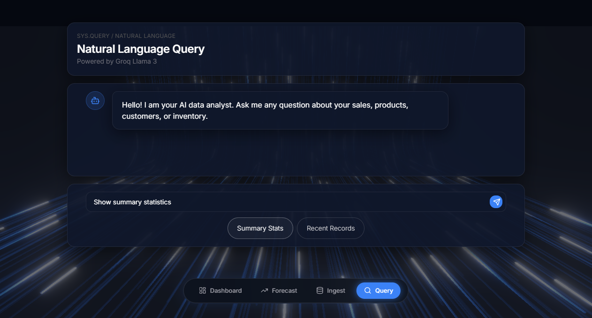
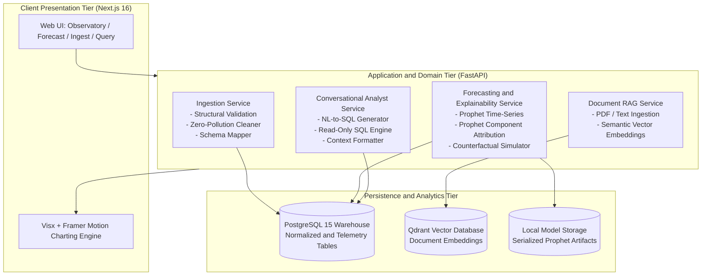

# CogniTwin — Enterprise AI Business Digital Twin Platform

[](https://www.python.org/)
[](https://fastapi.tiangolo.com/)
[](https://nextjs.org/)
[](https://www.postgresql.org/)
[](https://qdrant.tech/)
[](https://facebook.github.io/prophet/)
[](https://www.docker.com/)

CogniTwin is an end-to-end **AI Business Digital Twin** designed to replicate physical business dynamics in a continuous computational model. It unifies zero-pollution data ingestion, predictive machine learning, counterfactual what-if simulation, Prophet component explainability, and natural language executive analytics into a reactive, high-performance platform.

---

## Visual Showcase

### 1. Interactive Digital Twin Console
Real-time 3D signal telemetry and mathematical waveform canvas representing continuous business states.



---

### 2. Active Data Observatory
Live metric strips, indexed dataset records, and multi-timeline trend telemetry.



---

### 3. Natural Language Business Analyst
Conversational Text-to-SQL query generation, semantic vector document search, and business intelligence reporting.



---

## System Architecture

CogniTwin follows Clean Architecture with strict separation between ingestion, predictive modeling, vector retrieval, and reactive UI presentation.


### End-to-End Dataflow



---

## Core Capabilities

- **Zero-Pollution Dynamic Ingestion**: Automatic temporal axis detection, column type inference, anomaly isolation, and schema mapping directly into PostgreSQL warehouse entities.
- **Predictive Sales & Demand Forecasting**: Automated time-series modeling over a configurable horizon of up to 90 days. The model is chosen by history length: a regularized linear model (BayesianRidge) under 60 points, Facebook Prophet (multiplicative seasonality, yearly and weekly components) from 60, and Prophet plus LightGBM on its residuals from 365. What-if simulations return split-conformal prediction intervals calibrated on a backtest.
- **Factor Attribution (XAI)**: each forecast day is explained as the underlying trend level plus every factor's effect in ₹ (day of week, time of year, business levers such as price, discount and marketing spend, and the LightGBM stage's recent momentum). The factors add up exactly to the forecast, and the what-if simulator reports each changed lever's effect the same way.
- **Counterfactual What-If Simulation**: Dynamic sandbox allowing business operators to adjust promotional and operational sliders to evaluate projected revenue impacts before real-world execution.
- **Conversational Executive Analyst**: LLM-powered natural language query engine that translates plain English questions into safe, parameterized SQL queries executed against a read-only database replica.
- **Unstructured Document Intelligence**: Retrieval-Augmented Generation (RAG) powered by Qdrant vector storage for querying supplier contracts, vendor agreements, and invoices.

---

## Tech Stack

| Layer | Technologies |
|---|---|
| **Frontend** | Next.js 16 (App Router), React 19, TypeScript, Tailwind CSS, Visx, Framer Motion, Lucide Icons |
| **Backend** | FastAPI, Python 3.11+, Pydantic v2, SQLAlchemy 2.0 (AsyncIO), Alembic |
| **Machine Learning** | Facebook Prophet (component decomposition), scikit-learn (BayesianRidge), LightGBM, Pandas, NumPy, sqlglot (SQL AST validation) |
| **Databases** | PostgreSQL 15 (Relational Data Warehouse), Qdrant (Vector Database) |
| **LLM Orchestration** | Groq Async Client, Inline Prompt Templates, Deterministic Non-LLM Fallbacks |
| **DevOps & Infrastructure** | Docker, Docker Compose, Pytest, ESLint, Jest |

---

## API Endpoints

All endpoints are served under `/api/v1` and require the `X-API-Key` header (except `/health` and the OpenAPI docs). Full request/response contracts, error envelopes, and behavior notes live in [`docs/phase1/04-API-SPECIFICATION.md`](docs/phase1/04-API-SPECIFICATION.md).

| Method | Endpoint | Purpose |
|---|---|---|
| `GET` | `/health` | Liveness probe that actively pings the database, Qdrant, and checks the LLM key |
| `POST` | `/upload/{entity_type}` | Typed CSV upload into normalized warehouse entities |
| `POST` | `/ingest/csv` | Schemaless dynamic CSV upload into a dedicated `dataset_<uuid>` table |
| `GET` | `/data/summary` | Dashboard summary metrics, scoped to a dataset |
| `GET` | `/data/uploads` | Upload history (paginated) |
| `DELETE` | `/data/uploads/{upload_id}` | Undo an upload (drops dataset table, metadata, models) |
| `GET` | `/data/{dataset_id}/profile` | Column statistics (numeric + categorical) |
| `GET` | `/data/{dataset_id}/correlations` | Pearson/Spearman matrix with per-pair n |
| `GET` | `/data/{dataset_id}/scatter` | Sampled scatter points for two numeric columns |
| `GET` | `/data/{entity_type}` | Paginated entity rows |
| `POST` | `/forecast/train` | Start a background training job (`202` + `job_id`; `?wait=true` blocks) |
| `GET` | `/forecast/jobs/{job_id}` | Poll a training job |
| `GET` | `/forecast/predict` | Generate a forecast over a horizon (up to 90 days) |
| `GET` | `/forecast/status` | Trained-model availability and metadata |
| `POST` | `/forecast/simulate` | Counterfactual what-if simulation with lever mutations |
| `GET` | `/forecast/simulations` | List saved what-if scenarios (paginated, per dataset) |
| `GET` | `/forecast/simulations/compare?ids=` | Compare saved scenarios side by side |
| `GET` | `/forecast/explain/{product_id}` | Component-attribution explanation for one product |
| `GET` | `/forecast/explain-prescribe` | Unified forecast, drivers, anomaly check, and prescriptive actions |
| `POST` | `/documents/upload` | Parse, chunk, and embed a document into Qdrant |
| `POST` | `/documents/search` | Semantic search over indexed documents |
| `POST` | `/query` | Natural-language question → SQL → answer (read-only execution) |

---

## Project Structure

```
Cogni_Twin/
|-- backend/
|   |-- alembic/              # Database schema migrations
|   |-- scripts/              # DB seeding, initialization, and test scripts
|   |-- src/
|   |   |-- api/              # FastAPI endpoints and Pydantic schemas
|   |   |-- domain/           # Entities, value objects and business interfaces
|   |   |-- infrastructure/   # DB engine, Prophet forecaster, Qdrant store, LLM
|   |   |-- services/         # Ingestion, forecast, prescriptive, query services
|   |   `-- config.py         # Application configuration and settings
|   `-- tests/                # Unit and integration test suites
|-- frontend/
|   |-- src/app/              # Next.js pages: dashboard, forecast, ingest, query
|   |-- src/components/       # UI widgets, Visx charts, simulation sliders
|   `-- src/lib/              # API clients, formatters, utilities
|-- assets/                   # Architecture diagrams and visual documentation
|   |-- screenshots/          # High-resolution dashboard and UI captures
|   `-- architecture_overview.jpg
|-- docs/                     # Detailed architectural specifications and roadmap
|-- docker-compose.yml        # Multi-service container orchestration
`-- retail_enterprise_business_data.csv # Benchmark enterprise dataset (1,840 rows)
```

---

## Quickstart

### Prerequisites

- [Docker](https://docs.docker.com/get-docker/) and [Docker Compose](https://docs.docker.com/compose/)
- Python 3.11+ (for local development)
- Node.js 18+ and npm (for local development)

### 1. Clone & Configure

```bash
git clone https://github.com/Jaiadhithya/Cogni_Twin.git
cd Cogni_Twin
```

Copy environment templates:

```bash
# Backend environment setup
cp backend/.env.example backend/.env

# Frontend environment setup
cp frontend/.env.local.example frontend/.env.local
```

Configure your LLM API keys in `backend/.env`:
```env
GROQ_API_KEY=your_groq_api_key_here
# or
GEMINI_API_KEY=your_gemini_api_key_here
```

### 2. Run with Docker Compose

Start all services (PostgreSQL, Qdrant, FastAPI backend, Next.js frontend):

```bash
docker compose up --build
```

Access the applications:
- **Interactive Dashboard**: [http://localhost:3000](http://localhost:3000)
- **FastAPI Interactive Docs**: [http://localhost:8000/docs](http://localhost:8000/docs)
- **Qdrant Vector Web UI**: [http://localhost:6333/dashboard](http://localhost:6333/dashboard)

### 3. Ingest Sample Data

Upload [`retail_enterprise_business_data.csv`](retail_enterprise_business_data.csv) through the Ingest page (`http://localhost:3000/ingest`) to immediately populate continuous 2-year enterprise sales telemetry, train the Prophet model, and enable AI Q&A.

---

## Running Tests

### Backend Unit & Integration Tests
```bash
cd backend
pytest tests/ -v
```

### Frontend Component Tests
```bash
cd frontend
npm test
```

---

## License

This project is licensed under the MIT License.
