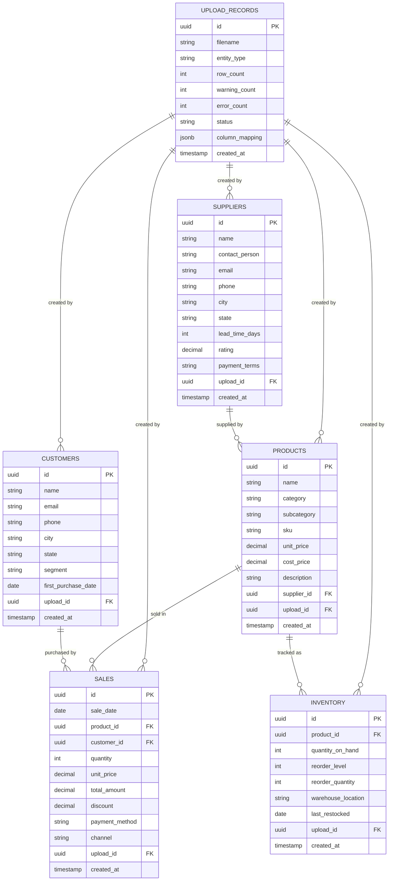

# Phase 1 — Database Schema Specification

> **Document Purpose**: Define every table, column, data type, constraint, index, and relationship in the PostgreSQL database. Define migration strategy, seed data format, and schema evolution rules. An AI coding agent should be able to write the complete Alembic migration from this document alone.

---

## 1. Why This Schema

The schema is designed around five core business entities that a small retail business operates with daily: **Sales**, **Products**, **Customers**, **Inventory**, and **Suppliers**. A sixth entity, **Upload Records**, tracks data lineage.

### Design Principles

1. **Normalized to 3NF**: Sales reference products and customers by foreign key. This prevents data duplication and ensures consistency. Denormalization is premature at Phase 1 scale (<100K rows).

2. **Upload lineage**: Every business record includes an `upload_id` foreign key to `upload_records`. This enables "undo upload" (delete all records from a specific upload) and data provenance tracking.

3. **Soft deletion not used**: Phase 1 uses hard deletes. Soft deletion (deleted_at column) adds query complexity without clear value at this stage. The upload-based lineage provides the "undo" capability.

4. **Timestamps on everything**: `created_at` on all tables. This is essential for debugging and future audit trails.

5. **Nullable by default for non-essential columns**: Small business CSV data is often incomplete. Required columns (marked NOT NULL) are limited to the absolute minimum needed for system functionality.

---

## 2. Entity Relationship Diagram



---

## 3. Table Definitions

### 3.1 `upload_records`

**Purpose**: Track every data upload operation. Enables undo, audit, and data lineage.

| Column | Type | Nullable | Default | Description |
|---|---|---|---|---|
| `id` | `UUID` | NO | `gen_random_uuid()` | Primary key |
| `filename` | `VARCHAR(255)` | NO | — | Original uploaded filename |
| `entity_type` | `VARCHAR(50)` | NO | — | One of: sales, products, customers, inventory, suppliers |
| `row_count` | `INTEGER` | NO | 0 | Number of rows successfully ingested |
| `warning_count` | `INTEGER` | NO | 0 | Number of warnings (filled values, type coercions) |
| `error_count` | `INTEGER` | NO | 0 | Number of rows that failed validation |
| `status` | `VARCHAR(20)` | NO | 'processing' | One of: processing, completed, failed |
| `column_mapping` | `JSONB` | YES | — | Applied column name mapping (original → target) |
| `warnings` | `JSONB` | YES | — | Array of warning messages |
| `errors` | `JSONB` | YES | — | Array of error messages |
| `created_at` | `TIMESTAMPTZ` | NO | `NOW()` | Upload timestamp |

**Constraints:**
- PK: `id`
- CHECK: `entity_type IN ('sales', 'products', 'customers', 'inventory', 'suppliers')`
- CHECK: `status IN ('processing', 'completed', 'failed')`

**Indexes:**
- `ix_upload_records_entity_type` on `entity_type`
- `ix_upload_records_created_at` on `created_at DESC`

---

### 3.2 `products`

**Purpose**: Product catalog. Referenced by sales and inventory.

| Column | Type | Nullable | Default | Description |
|---|---|---|---|---|
| `id` | `UUID` | NO | `gen_random_uuid()` | Primary key |
| `name` | `VARCHAR(255)` | NO | — | Product name |
| `category` | `VARCHAR(100)` | YES | — | Product category (e.g., Electronics, Clothing) |
| `subcategory` | `VARCHAR(100)` | YES | — | Product subcategory |
| `sku` | `VARCHAR(50)` | YES | — | Stock keeping unit (unique if provided) |
| `unit_price` | `DECIMAL(12,2)` | YES | — | Selling price per unit |
| `cost_price` | `DECIMAL(12,2)` | YES | — | Cost/purchase price per unit |
| `description` | `TEXT` | YES | — | Product description |
| `supplier_id` | `UUID` | YES | — | FK to suppliers |
| `upload_id` | `UUID` | NO | — | FK to upload_records |
| `created_at` | `TIMESTAMPTZ` | NO | `NOW()` | Record creation timestamp |

**Constraints:**
- PK: `id`
- FK: `supplier_id` REFERENCES `suppliers(id)` ON DELETE SET NULL
- FK: `upload_id` REFERENCES `upload_records(id)` ON DELETE CASCADE
- UNIQUE: `sku` WHERE `sku IS NOT NULL` (partial unique index)

**Indexes:**
- `ix_products_category` on `category`
- `ix_products_name` on `name`
- `uq_products_sku` unique partial index on `sku` WHERE `sku IS NOT NULL`

**Why `supplier_id` is nullable**: Products may be uploaded before suppliers. The relationship can be established later. Enforcing non-null would break the upload-in-any-order requirement.

---

### 3.3 `customers`

**Purpose**: Customer information. Referenced by sales for customer analytics.

| Column | Type | Nullable | Default | Description |
|---|---|---|---|---|
| `id` | `UUID` | NO | `gen_random_uuid()` | Primary key |
| `name` | `VARCHAR(255)` | NO | — | Customer name |
| `email` | `VARCHAR(255)` | YES | — | Email address |
| `phone` | `VARCHAR(50)` | YES | — | Phone number |
| `city` | `VARCHAR(100)` | YES | — | City |
| `state` | `VARCHAR(100)` | YES | — | State/province |
| `segment` | `VARCHAR(50)` | YES | — | Customer segment (e.g., Premium, Regular, Wholesale) |
| `first_purchase_date` | `DATE` | YES | — | Date of first purchase |
| `upload_id` | `UUID` | NO | — | FK to upload_records |
| `created_at` | `TIMESTAMPTZ` | NO | `NOW()` | Record creation timestamp |

**Constraints:**
- PK: `id`
- FK: `upload_id` REFERENCES `upload_records(id)` ON DELETE CASCADE

**Indexes:**
- `ix_customers_segment` on `segment`
- `ix_customers_city` on `city`
- `ix_customers_name` on `name`

---

### 3.4 `suppliers`

**Purpose**: Supplier information for procurement analytics.

| Column | Type | Nullable | Default | Description |
|---|---|---|---|---|
| `id` | `UUID` | NO | `gen_random_uuid()` | Primary key |
| `name` | `VARCHAR(255)` | NO | — | Supplier name |
| `contact_person` | `VARCHAR(255)` | YES | — | Contact person name |
| `email` | `VARCHAR(255)` | YES | — | Contact email |
| `phone` | `VARCHAR(50)` | YES | — | Contact phone |
| `city` | `VARCHAR(100)` | YES | — | Supplier city |
| `state` | `VARCHAR(100)` | YES | — | Supplier state |
| `lead_time_days` | `INTEGER` | YES | — | Average delivery lead time in days |
| `rating` | `DECIMAL(3,2)` | YES | — | Supplier rating (0.00 to 5.00) |
| `payment_terms` | `VARCHAR(100)` | YES | — | Payment terms (e.g., Net 30, COD) |
| `upload_id` | `UUID` | NO | — | FK to upload_records |
| `created_at` | `TIMESTAMPTZ` | NO | `NOW()` | Record creation timestamp |

**Constraints:**
- PK: `id`
- FK: `upload_id` REFERENCES `upload_records(id)` ON DELETE CASCADE
- CHECK: `rating >= 0 AND rating <= 5` WHERE `rating IS NOT NULL`

**Indexes:**
- `ix_suppliers_name` on `name`

---

### 3.5 `sales`

**Purpose**: Individual sales transactions. The primary data source for forecasting and analytics.

| Column | Type | Nullable | Default | Description |
|---|---|---|---|---|
| `id` | `UUID` | NO | `gen_random_uuid()` | Primary key |
| `sale_date` | `DATE` | NO | — | Date of sale |
| `product_id` | `UUID` | YES | — | FK to products (nullable if product data not uploaded) |
| `customer_id` | `UUID` | YES | — | FK to customers (nullable if customer data not uploaded) |
| `quantity` | `INTEGER` | NO | 1 | Number of units sold |
| `unit_price` | `DECIMAL(12,2)` | NO | — | Price per unit at time of sale |
| `total_amount` | `DECIMAL(12,2)` | NO | — | Total sale amount (quantity × unit_price - discount) |
| `discount` | `DECIMAL(12,2)` | YES | 0.00 | Discount applied |
| `payment_method` | `VARCHAR(50)` | YES | — | e.g., Cash, Card, UPI, Credit |
| `channel` | `VARCHAR(50)` | YES | — | e.g., Online, Store, Wholesale |
| `product_name` | `VARCHAR(255)` | YES | — | Denormalized product name (for when product_id is null) |
| `customer_name` | `VARCHAR(255)` | YES | — | Denormalized customer name (for when customer_id is null) |
| `upload_id` | `UUID` | NO | — | FK to upload_records |
| `created_at` | `TIMESTAMPTZ` | NO | `NOW()` | Record creation timestamp |

**Constraints:**
- PK: `id`
- FK: `product_id` REFERENCES `products(id)` ON DELETE SET NULL
- FK: `customer_id` REFERENCES `customers(id)` ON DELETE SET NULL
- FK: `upload_id` REFERENCES `upload_records(id)` ON DELETE CASCADE
- CHECK: `quantity > 0`
- CHECK: `unit_price >= 0`
- CHECK: `total_amount >= 0`

**Indexes:**
- `ix_sales_sale_date` on `sale_date` — **critical for time-series queries and forecasting**
- `ix_sales_product_id` on `product_id`
- `ix_sales_customer_id` on `customer_id`
- `ix_sales_upload_id` on `upload_id`
- `ix_sales_date_amount` composite on `(sale_date, total_amount)` — for aggregation queries

**Why `product_name` and `customer_name` denormalized columns exist**: A user may upload sales data without separately uploading product/customer data. In that case, `product_id` and `customer_id` are NULL, but the original names from the CSV are preserved in these denormalized columns. This ensures sales data is always usable for forecasting regardless of whether reference data exists.

---

### 3.6 `inventory`

**Purpose**: Current inventory snapshots for stock analysis.

| Column | Type | Nullable | Default | Description |
|---|---|---|---|---|
| `id` | `UUID` | NO | `gen_random_uuid()` | Primary key |
| `product_id` | `UUID` | YES | — | FK to products |
| `product_name` | `VARCHAR(255)` | YES | — | Denormalized (for when product_id is null) |
| `quantity_on_hand` | `INTEGER` | NO | 0 | Current stock quantity |
| `reorder_level` | `INTEGER` | YES | — | Minimum stock before reorder |
| `reorder_quantity` | `INTEGER` | YES | — | Quantity to order when restocking |
| `warehouse_location` | `VARCHAR(100)` | YES | — | Warehouse or section identifier |
| `last_restocked` | `DATE` | YES | — | Date of last restock |
| `upload_id` | `UUID` | NO | — | FK to upload_records |
| `created_at` | `TIMESTAMPTZ` | NO | `NOW()` | Record creation timestamp |

**Constraints:**
- PK: `id`
- FK: `product_id` REFERENCES `products(id)` ON DELETE SET NULL
- FK: `upload_id` REFERENCES `upload_records(id)` ON DELETE CASCADE
- CHECK: `quantity_on_hand >= 0`

**Indexes:**
- `ix_inventory_product_id` on `product_id`

---

## 4. Read-Only Database Role

For security when executing LLM-generated SQL:

```sql
-- Create a read-only role for LLM query execution
CREATE ROLE cognitwin_readonly WITH LOGIN PASSWORD '<password>';
GRANT CONNECT ON DATABASE cognitwin TO cognitwin_readonly;
GRANT USAGE ON SCHEMA public TO cognitwin_readonly;
GRANT SELECT ON ALL TABLES IN SCHEMA public TO cognitwin_readonly;
ALTER DEFAULT PRIVILEGES IN SCHEMA public GRANT SELECT ON TABLES TO cognitwin_readonly;
```

**Why**: The LLM generates SQL from user questions. Even with SQL validation (blocking non-SELECT), a read-only database role provides defense-in-depth. If the validation is bypassed, the database itself prevents mutations.

---

## 5. Migration Strategy

### Tool: Alembic

**Why Alembic**: It's the standard SQLAlchemy migration tool. It tracks migration versions, supports up/down migrations, and integrates with the ORM models.

### Migration Rules

1. **Never modify a committed migration** — create a new one instead.
2. **Every migration must be reversible** — include both `upgrade()` and `downgrade()`.
3. **Migration naming**: `{revision_id}_{description}.py` (auto-generated by Alembic).
4. **Initial migration**: Creates all 6 tables, indexes, constraints, and the read-only role.
5. **Seed data is NOT in migrations** — seed data is a separate script (`seed/load_seeds.py`).

### Initial Migration Content

The initial migration (`001_initial_schema`) must create:
- All 6 tables as defined above
- All indexes
- All constraints
- The `cognitwin_readonly` role and its permissions

---

## 6. Seed Data Specification

Seed data enables immediate demo functionality without requiring the user to upload their own data first.

### Seed Files Location: `backend/seed/`

Each seed file is a CSV that matches the exact schema of its corresponding table (excluding auto-generated fields like `id`, `created_at`, and `upload_id`).

### `products.csv` — 25 products

Must include:
- 5 categories (Electronics, Clothing, Food & Beverage, Home & Garden, Office Supplies)
- 5 products per category
- Realistic names, SKUs, prices (both unit_price and cost_price)
- Price range: ₹100 to ₹50,000

### `customers.csv` — 50 customers

Must include:
- Mix of segments (Premium: 10, Regular: 30, Wholesale: 10)
- Indian city names (Mumbai, Delhi, Bangalore, Chennai, Hyderabad, Pune, etc.)
- Realistic Indian names
- first_purchase_date spanning 2 years

### `suppliers.csv` — 10 suppliers

Must include:
- Diverse lead_time_days (3 to 30)
- Rating distribution (2.5 to 5.0)
- Various payment terms
- Indian business names and cities

### `sales.csv` — 4,380 records (12 months × ~365 days, multiple per day)

Must include:
- Date range: 2024-01-01 to 2024-12-31
- 3-15 transactions per day
- Realistic seasonal patterns:
  - Higher sales in October-November (Diwali season)
  - Lower sales in June-July (monsoon lull)
  - Weekend vs weekday variation
- Mix of products, customers, payment methods, channels
- Some days with zero sales (holidays)
- Occasional high-value wholesale orders
- Realistic discount patterns (0%, 5%, 10%, 15%, 20%)

### `inventory.csv` — 25 records (one per product)

Must include:
- Quantity range: 0 to 500
- Some products below reorder level (for demo alerts)
- Some products at zero stock

### Seed Data Loading

A script `backend/seed/load_seeds.py` must:
1. Create an upload_record with filename="seed_data" for each entity type
2. Read each CSV
3. Insert records with the seed upload_id
4. Be idempotent (check if seed data exists before inserting; skip if present)
5. Be callable from Docker entrypoint or standalone

---

## 7. Schema Evolution Rules

These rules govern how the schema may change in future phases:

1. **New tables**: Add via new Alembic migration. No existing table modifications needed.
2. **New columns on existing tables**: Add as NULLABLE with DEFAULT. Never add NOT NULL to an existing table without a data migration.
3. **Column type changes**: Create a new column, migrate data, drop old column. Never alter type in-place.
4. **Index additions**: Always add indexes in separate migrations from data changes.
5. **Foreign key additions**: Add as NULLABLE FK first. Phase 2 may add `documents` and `embeddings` tables — these will be new tables with no impact on existing schema.
