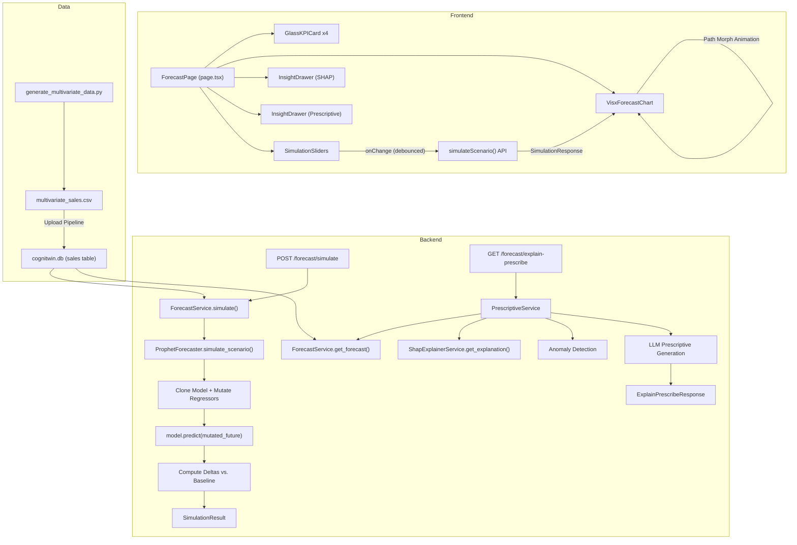

# Cognitia Twin — Phase 6 & Digital Twin Overhaul

## System Blueprint: Transform from retrospective BI dashboard to a living, predictive, prescriptive Business Digital Twin.

---

## User Review Required

> [!IMPORTANT]
> **Breaking Change: Data Schema Migration.** The current CSV upload pipeline ingests simple `sale_date`, `quantity`, `unit_price`, `total_amount` columns. Phase 6 introduces a new multi-variate schema with exogenous regressors (`unit_price`, `marketing_spend`, `supplier_lead_time_days`, `competitor_discount_pct`). Existing trained Prophet models will be **invalidated** and must be retrained on the new dataset. The model registry will be wiped on first Phase 6 training.

> [!WARNING]
> **Frontend Dependency Overhaul.** Recharts will be replaced with Airbnb Visx + Framer Motion. This is a significant change to the charting pipeline. The existing `RevenueChart.tsx` and forecast `ComposedChart` will be fully rewritten. ShadCN/Tailwind CSS remain as the base styling system, but custom glassmorphic components and spring-physics animations will be layered on top.

> [!IMPORTANT]
> **New npm Packages Required.** The frontend will need: `@visx/shape`, `@visx/scale`, `@visx/group`, `@visx/curve`, `@visx/gradient`, `@visx/tooltip`, `@visx/responsive`, `@visx/axis`, `@visx/pattern`, `framer-motion`, `d3-interpolate-path`, and `d3-scale`. These are well-maintained, production-grade libraries.

---

## Open Questions

> [!IMPORTANT]
> **Q1: Synthetic Data vs. Real Data Upload.** Should the new multi-variate CSV generator be a one-time seed script, or should we also upgrade the Upload page to accept CSVs with the new regressor columns? The plan currently treats the generator as a development seed + demo tool, and the upload pipeline remains backward-compatible (detecting regressor columns if present).

> [!IMPORTANT]
> **Q2: Groq Model Selection for Simulation Intent.** The current system uses `llama-3.3-70b-versatile` via Groq. The SIMULATION intent requires structured JSON extraction from natural language. Should we keep the same model, or switch to a model with stronger structured output (e.g., `llama-3.1-70b-versatile` with JSON mode, or Mixtral)?

> [!IMPORTANT]
> **Q3: Slider Ranges for What-If Controls.** The plan proposes these default slider ranges for the Digital Twin Control Center. Please confirm or adjust:
> | Lever | Min | Max | Default | Step |
> |---|---|---|---|---|
> | Unit Price (₹) | -30% | +50% | 0% | 1% |
> | Marketing Spend (₹) | -50% | +200% | 0% | 5% |
> | Supplier Lead Time (days) | -10 | +15 | 0 | 1 |
> | Competitor Discount (%) | -10pp | +20pp | 0pp | 1pp |

---

## Proposed Changes

The overhaul spans 4 vectors across ~25 files (12 new, 13 modified). Changes are grouped by component in dependency order.

---

### Vector 1: Synthetic Multi-Variate Data Generator

This is a standalone Python script that produces a realistic 2-year daily business dataset with embedded mathematical correlations between the target variable and external levers.

#### [NEW] [generate_multivariate_data.py](file:///c:/ML%20Project/backend/scripts/generate_multivariate_data.py)

**Purpose:** Generate `multivariate_sales.csv` with columns: `ds`, `sales_volume`, `unit_price`, `marketing_spend`, `supplier_lead_time_days`, `competitor_discount_pct`, `revenue`.

**Mathematical Correlation Model:**

```
Base Volume ~ Poisson(λ=120) + Trend(+0.15/day) + Weekly Seasonality + Yearly Seasonality

Exogenous Effects:
  price_effect      = -2.5 × (unit_price - mean_price)           # Negative price elasticity
  marketing_effect  = +0.08 × marketing_spend                     # Positive linear lift
  leadtime_effect   = -8.0 × max(0, supplier_lead_time - 5)      # Stockout penalty above 5 days
  competitor_effect = -1.2 × competitor_discount_pct              # Competitive pressure

sales_volume = max(0, base + price_effect + marketing_effect + leadtime_effect + competitor_effect + ε)
revenue      = sales_volume × unit_price
```

**Key Design Decisions:**
- `unit_price` varies sinusoidally around ₹250 ± ₹80 with quarterly promotional dips
- `marketing_spend` follows a realistic budget pattern: baseline ₹15,000/day with festival spikes (Diwali, Pongal, Republic Day)
- `supplier_lead_time_days` is normally distributed ~N(4, 1.5) with occasional disruption events (monsoon, port strikes) injecting 10–15 day delays
- `competitor_discount_pct` follows a stepped pattern with seasonal sale events
- Noise term ε ~ N(0, 15) to prevent perfect-fit overfitting

**Output:** Saved to `backend/uploads/multivariate_sales.csv` (~730 rows).

---

### Vector 2: Counterfactual Prophet Simulation Engine (Backend)

Upgrades the ML layer to support exogenous regressors and counterfactual simulation.

---

#### [MODIFY] [prophet_forecaster.py](file:///c:/ML%20Project/backend/src/infrastructure/ml/prophet_forecaster.py)

**Current state:** Trains Prophet with only `ds` and `y` columns. No `add_regressor()` calls.

**Changes:**
1. **`train()` method upgrade:** Detect if input data contains regressor columns (`unit_price`, `marketing_spend`, `supplier_lead_time_days`, `competitor_discount_pct`). If present, call `model.add_regressor(col)` for each before `model.fit()`. Store the regressor column names in model metadata.
2. **New `simulate_scenario()` method:**
   ```python
   async def simulate_scenario(
       self,
       horizon_days: int,
       mutations: dict[str, str],  # e.g., {"unit_price": "+15%", "marketing_spend": "+50000"}
       baseline_forecast: list[ForecastPoint] | None = None
   ) -> SimulationResult:
   ```
   - Clones the trained model's internal state (serialize/deserialize via JSON)
   - Builds the future regressor DataFrame using the last known regressor values as baseline
   - Applies mutations: percentage changes (`"+15%"`) or absolute deltas (`"+5"`)
   - Calls `model.predict()` on the mutated future DataFrame
   - Computes delta arrays: `Δ_revenue`, `Δ_volume`, `Δ_margin` vs. baseline
   - Returns `SimulationResult` containing both baseline and mutated forecast curves
3. **Store regressor state:** After training, persist the last-known regressor values (last row of training data) alongside the model, so simulation can construct future DataFrames without re-querying the database.

#### [NEW] [simulation_result.py](file:///c:/ML%20Project/backend/src/domain/value_objects/simulation_result.py)

New value object:
```python
@dataclass(frozen=True)
class SimulationPoint:
    date: str
    baseline_predicted: float
    mutated_predicted: float
    delta: float
    delta_pct: float

@dataclass(frozen=True)
class SimulationResult:
    mutations_applied: dict[str, str]
    baseline_total: float
    mutated_total: float
    total_delta: float
    total_delta_pct: float
    points: list[SimulationPoint]
    available_levers: list[str]
```

#### [MODIFY] [forecaster.py](file:///c:/ML%20Project/backend/src/domain/interfaces/forecaster.py)

Add new method to the `Forecaster` protocol:
```python
async def simulate_scenario(
    self,
    horizon_days: int,
    mutations: dict[str, str],
    baseline_forecast: list[ForecastPoint] | None = None
) -> SimulationResult: ...

def get_available_regressors(self) -> list[str]: ...
```

#### [MODIFY] [forecast_service.py](file:///c:/ML%20Project/backend/src/services/forecast_service.py)

Add new method:
```python
async def simulate(self, horizon_days: int, mutations: dict[str, str]) -> dict:
    """Execute a counterfactual simulation with mutated regressors."""
```
This method:
1. Validates the model is trained with regressors
2. Calls `forecaster.simulate_scenario()`
3. Returns the simulation result as a serializable dict

#### [MODIFY] [forecast_service.py](file:///c:/ML%20Project/backend/src/services/forecast_service.py) — `train_model()` upgrade

Modify `train_model()` to pass the full multi-variate DataFrame (not just `date`/`actual`) to the forecaster when regressor columns are detected.

---

#### New API Endpoint: Simulation

#### [MODIFY] [forecast_router.py](file:///c:/ML%20Project/backend/src/api/forecast_router.py)

Add new endpoint:
```
POST /api/v1/forecast/simulate
```

#### [MODIFY] [forecast.py (schemas)](file:///c:/ML%20Project/backend/src/api/schemas/forecast.py)

Add new Pydantic schemas:

```python
class SimulationRequest(BaseModel):
    horizon_days: int = Field(default=30, ge=7, le=90)
    mutations: dict[str, str]  # {"unit_price": "+15%", "marketing_spend": "+50000"}

class SimulationPointSchema(BaseModel):
    date: str
    baseline_predicted: float
    mutated_predicted: float
    delta: float
    delta_pct: float

class SimulationResponseData(BaseModel):
    mutations_applied: dict[str, str]
    baseline_total: float
    mutated_total: float
    total_delta: float
    total_delta_pct: float
    points: list[SimulationPointSchema]
    available_levers: list[str]
```

**API JSON Response Schema for `/api/v1/forecast/simulate`:**
```json
{
  "status": "success",
  "data": {
    "mutations_applied": {"unit_price": "+15%"},
    "baseline_total": 2450000.00,
    "mutated_total": 2180000.00,
    "total_delta": -270000.00,
    "total_delta_pct": -11.02,
    "points": [
      {
        "date": "2026-07-27",
        "baseline_predicted": 82000.0,
        "mutated_predicted": 72840.0,
        "delta": -9160.0,
        "delta_pct": -11.17
      }
    ],
    "available_levers": ["unit_price", "marketing_spend", "supplier_lead_time_days", "competitor_discount_pct"]
  }
}
```

---

#### SIMULATION Intent — LLM Natural Language Extraction

#### [MODIFY] [query_intent.py](file:///c:/ML%20Project/backend/src/domain/value_objects/query_intent.py)

Add `SIMULATION = "SIMULATION"` to the `QueryIntent` enum.

#### [MODIFY] [query_service.py](file:///c:/ML%20Project/backend/src/services/query_service.py)

1. Update `_classify_intent()` prompt to include the new `SIMULATION` category:
   ```
   - SIMULATION: What-if scenarios, counterfactual questions about changing price/marketing/supply chain
   ```
2. Add new handler `_execute_simulation_query()`:
   - Uses LLM to extract structured mutations JSON from natural language
   - Calls `forecast_service.simulate()`
   - Returns the simulation result as a chat response

**LLM Extraction Prompt for SIMULATION intent:**
```
You are a business scenario parser. Extract the exact parameter mutations from this What-If question.

AVAILABLE LEVERS: unit_price, marketing_spend, supplier_lead_time_days, competitor_discount_pct

QUESTION: "{question}"

Return a JSON object with ONLY the changed parameters. Use percentage notation for relative changes ("+15%", "-10%") or absolute deltas ("+5", "-2000").

Examples:
- "What if we increase price by 15%?" → {"unit_price": "+15%"}
- "What happens if marketing budget doubles?" → {"marketing_spend": "+100%"}
- "Simulate supplier delay of 5 extra days" → {"supplier_lead_time_days": "+5"}

Return ONLY valid JSON, no explanation.
```

---

### Vector 3: Prescriptive AI & Explanation Fusion

Fuses SHAP decomposition, anomaly detection, and LLM-driven prescriptive actions into a unified forecast explanation payload.

---

#### New API Endpoint: Explain + Prescribe

#### [NEW] [explain_prescribe_router.py](file:///c:/ML%20Project/backend/src/api/explain_prescribe_router.py)

New endpoint:
```
GET /api/v1/forecast/explain-prescribe?horizon_days=30
```

Returns a unified payload combining forecast, SHAP drivers, anomaly flags, and LLM prescriptive actions.

#### [NEW] [explain_prescribe.py (schema)](file:///c:/ML%20Project/backend/src/api/schemas/explain_prescribe.py)

```python
class PrescriptiveAction(BaseModel):
    priority: int  # 1, 2, 3
    action: str
    expected_impact: str
    timeframe: str

class ExplainPrescribeResponseData(BaseModel):
    forecast_points: list[ForecastPoint]
    shap_drivers: ShapDriversPayload  # top 3 positive, top 3 negative
    anomaly_detected: bool
    anomaly_description: str | None
    prescriptive_actions: list[PrescriptiveAction]
    executive_summary: str
```

**API JSON Response Schema for `/api/v1/forecast/explain-prescribe`:**
```json
{
  "status": "success",
  "data": {
    "forecast_points": [{"date": "2026-07-27", "predicted": 82000.0, "lower_bound": 68000.0, "upper_bound": 96000.0}],
    "shap_drivers": {
      "positive": [
        {"feature": "marketing_spend", "contribution": 12500.0, "description": "Recent marketing investment is driving volume up"}
      ],
      "negative": [
        {"feature": "supplier_lead_time_days", "contribution": -8400.0, "description": "Supply chain delays are suppressing availability"}
      ]
    },
    "anomaly_detected": true,
    "anomaly_description": "Revenue is projected to decline 18% over the next 14 days due to supplier disruptions.",
    "prescriptive_actions": [
      {
        "priority": 1,
        "action": "Activate secondary supplier (Vendor C) immediately to reduce lead times from 12 to 4 days.",
        "expected_impact": "Recover ₹1.2L in lost daily revenue within 5 days.",
        "timeframe": "Immediate (24–48 hours)"
      },
      {
        "priority": 2,
        "action": "Increase digital marketing spend by 30% to offset volume decline with higher conversion.",
        "expected_impact": "Compensate for ~40% of projected volume loss.",
        "timeframe": "This week"
      },
      {
        "priority": 3,
        "action": "Hold pricing steady — avoid price increases during supply disruption to retain customer loyalty.",
        "expected_impact": "Prevent additional 5–8% volume erosion from price sensitivity.",
        "timeframe": "Ongoing (2 weeks)"
      }
    ],
    "executive_summary": "⚠️ Revenue decline detected..."
  }
}
```

#### [NEW] [prescriptive_service.py](file:///c:/ML%20Project/backend/src/services/prescriptive_service.py)

New service that orchestrates the full explain-prescribe pipeline:
1. Gets forecast from `ForecastService`
2. Computes SHAP decomposition via `ShapExplainerService`
3. Detects anomalies (>10% decline in 7-day rolling average vs. trailing 30-day mean)
4. If anomaly detected, generates prescriptive actions via LLM using a specialized prompt that includes the SHAP drivers as context
5. Returns the unified `ExplainPrescribeResponseData`

**LLM Prescriptive Prompt:**
```
You are a senior business strategist. Given this forecast analysis, generate exactly 3 prioritized, actionable steps.

FORECAST: Revenue projected to {direction} by {pct}% over next {horizon} days.
TOP POSITIVE DRIVERS: {positive_drivers}
TOP NEGATIVE DRIVERS: {negative_drivers}
CURRENT LEVER VALUES: Price=₹{price}, Marketing=₹{marketing}/day, Lead Time={lead_time} days

RULES:
1. Each action must be concrete (name specific levers, numbers, timeframes).
2. Include expected ₹ impact in Indian numbering (Lakhs/Crores).
3. First action = highest urgency. Third = strategic/preventive.
4. Use ₹ with en-IN formatting. No technical jargon.
5. Return as JSON array: [{"priority": 1, "action": "...", "expected_impact": "...", "timeframe": "..."}]
```

#### [MODIFY] [router.py](file:///c:/ML%20Project/backend/src/api/router.py)

Register the new `explain_prescribe_router`.

#### [MODIFY] [dependencies.py](file:///c:/ML%20Project/backend/src/dependencies.py)

Add dependency injection for `PrescriptiveService`.

---

#### [MODIFY] [shap_engine.py](file:///c:/ML%20Project/backend/src/infrastructure/ml/shap_engine.py)

Upgrade `ShapEngine` to decompose exogenous regressor contributions when present. Currently only decomposes `trend`, `yearly`, `weekly`, `holidays`. After Phase 6, the trained model will have regressor components (`unit_price`, `marketing_spend`, etc.) in the forecast DataFrame. The engine will extract these additional columns and rank them alongside the native Prophet components.

Updated `COMPONENT_LABELS`:
```python
COMPONENT_LABELS = {
    "trend": "Long-term business trajectory",
    "yearly": "Yearly seasonal pattern",
    "weekly": "Day-of-week effect",
    "holidays": "Holiday/event impact",
    "unit_price": "Pricing lever impact",
    "marketing_spend": "Marketing investment return",
    "supplier_lead_time_days": "Supply chain efficiency",
    "competitor_discount_pct": "Competitive pricing pressure",
}
```

---

### Vector 4: Apple-Grade Interactive UX (Visx + Framer Motion)

Complete frontend overhaul of the Forecast / Simulation page. Other pages (Dashboard, Upload, Documents, Query) receive minor polish but are NOT rewritten.

---

#### New Frontend Dependencies

#### [MODIFY] [package.json](file:///c:/ML%20Project/frontend/package.json)

Add to `dependencies`:
```json
"@visx/axis": "^3.12.0",
"@visx/curve": "^3.12.0",
"@visx/gradient": "^3.12.0",
"@visx/group": "^3.12.0",
"@visx/responsive": "^3.12.0",
"@visx/scale": "^3.12.0",
"@visx/shape": "^3.12.0",
"@visx/tooltip": "^3.12.0",
"@visx/pattern": "^3.12.0",
"framer-motion": "^12.12.0",
"d3-interpolate-path": "^2.3.0"
```

---

#### New API Client Functions

#### [MODIFY] [api.ts](file:///c:/ML%20Project/frontend/src/lib/api.ts)

Add:
```typescript
// Simulation API
export const simulateScenario = (mutations: Record<string, string>, horizonDays = 30) =>
  fetchApi<SimulationResponse>('/forecast/simulate', {
    method: 'POST',
    body: JSON.stringify({ mutations, horizon_days: horizonDays }),
  });

// Explain + Prescribe API
export const getExplainPrescribe = (horizonDays = 30) =>
  fetchApi<ExplainPrescribeResponse>(`/forecast/explain-prescribe?horizon_days=${horizonDays}`);
```

---

#### The Digital Twin Control Center (New Forecast Page)

#### [MODIFY] [forecast/page.tsx](file:///c:/ML%20Project/frontend/src/app/forecast/page.tsx) — Full Rewrite

The forecast page transforms from a static Recharts line chart into an interactive **Digital Twin Control Center** with 4 distinct zones:

**Zone 1: KPI Strip** — Glassmorphic cards showing: Projected Revenue (₹), Δ vs. Baseline, Model Status, Anomaly Flag. All values in `₹` with `en-IN` locale.

**Zone 2: Interactive Visx Chart** — Full SVG chart with:
- Gradient-filled area for confidence interval
- Solid line for baseline `yhat`
- Animated dashed line for mutated `yhat` (appears when sliders are adjusted)
- Smooth spring-physics path interpolation between baseline and mutated curves using `d3-interpolate-path`
- Hover tooltip with glassmorphic styling showing date, baseline, mutated, and delta

**Zone 3: Lever Control Panel** — 4 interactive sliders (Framer Motion):
- Unit Price (% change)
- Marketing Spend (% change)
- Supplier Lead Time (absolute days delta)
- Competitor Discount (percentage point delta)
- Each slider triggers a debounced API call to `/forecast/simulate`
- Real-time chart morphing as the API responds

**Zone 4: Collapsible Insight Drawers** (Framer Motion `AnimatePresence`):
- **"Why" Drawer:** SHAP decomposition showing positive/negative drivers with animated bar widths
- **"What To Do" Drawer:** LLM prescriptive actions displayed as priority-numbered cards with urgency color coding

---

#### New Frontend Components

#### [NEW] [VisxForecastChart.tsx](file:///c:/ML%20Project/frontend/src/components/forecast/VisxForecastChart.tsx)

The core Visx SVG chart component:
- Uses `@visx/scale` for x (time) and y (₹ revenue) scales
- `@visx/shape/LinePath` for baseline and mutated curves
- `@visx/gradient/LinearGradient` for confidence interval fill
- `@visx/tooltip` for glassmorphic hover tooltips
- `@visx/responsive/ParentSize` for responsive resizing
- `@visx/axis/AxisBottom` and `AxisLeft` for clean axis rendering
- `@visx/curve/curveMonotoneX` for smooth interpolation
- Path morphing via `d3-interpolate-path` for fluid transitions between baseline and mutated states

#### [NEW] [SimulationSliders.tsx](file:///c:/ML%20Project/frontend/src/components/forecast/SimulationSliders.tsx)

Glassmorphic slider panel:
- 4 custom range sliders with Framer Motion spring animations
- Each slider shows current value, min/max labels, and live delta indicator
- Debounced `onChange` handler (300ms) triggers `simulateScenario()` API call
- "Reset All" button with spring-back animation

#### [NEW] [InsightDrawer.tsx](file:///c:/ML%20Project/frontend/src/components/forecast/InsightDrawer.tsx)

Framer Motion collapsible drawer for SHAP "Why" and Prescriptive "Action" panels:
- Uses `AnimatePresence` and `motion.div` with layout animations
- Expands/collapses with spring physics (`stiffness: 300, damping: 30`)
- SHAP drivers rendered as animated horizontal bars (width proportional to contribution magnitude)
- Prescriptive actions rendered as numbered priority cards with urgency gradients

#### [NEW] [GlassKPICard.tsx](file:///c:/ML%20Project/frontend/src/components/forecast/GlassKPICard.tsx)

Glassmorphic KPI card with:
- `backdrop-filter: blur(20px)` with layered box-shadows for floating effect
- Animated counter for numeric values (count-up on mount)
- Delta indicator with color-coded arrow (green up / red down)
- Subtle noise texture overlay

#### [MODIFY] [ShapExplanationPanel.tsx](file:///c:/ML%20Project/frontend/src/app/forecast/components/ShapExplanationPanel.tsx)

Integrate into the new `InsightDrawer` component. Keep the existing data rendering logic but wrap in Framer Motion layout animations. Add animated bar chart visualization for driver magnitudes.

---

#### Currency & Locale Fix

#### [NEW] [formatters.ts](file:///c:/ML%20Project/frontend/src/lib/formatters.ts)

Centralized INR formatting utility:
```typescript
export const formatINR = (value: number): string =>
  new Intl.NumberFormat('en-IN', {
    style: 'currency',
    currency: 'INR',
    maximumFractionDigits: 0,
  }).format(value);

export const formatINRCompact = (value: number): string => {
  if (value >= 10_000_000) return `₹${(value / 10_000_000).toFixed(1)}Cr`;
  if (value >= 100_000) return `₹${(value / 100_000).toFixed(1)}L`;
  return formatINR(value);
};

export const formatDelta = (value: number): string =>
  `${value >= 0 ? '+' : ''}${formatINR(value)}`;

export const formatDeltaPct = (value: number): string =>
  `${value >= 0 ? '+' : ''}${value.toFixed(1)}%`;
```

#### [MODIFY] [RevenueChart.tsx](file:///c:/ML%20Project/frontend/src/components/dashboard/RevenueChart.tsx)

Replace `$` formatting with `₹` and `en-IN` locale in Y-axis and tooltip.

#### [MODIFY] [TopProducts.tsx](file:///c:/ML%20Project/frontend/src/components/dashboard/TopProducts.tsx)

Replace `$` formatting with `₹` and `en-IN` locale.

---

#### CSS & Design System Updates

#### [MODIFY] [globals.css](file:///c:/ML%20Project/frontend/src/app/globals.css)

Add new CSS custom properties and utility classes:
```css
/* Glassmorphism tokens */
--glass-bg: rgba(15, 20, 35, 0.6);
--glass-border: rgba(255, 255, 255, 0.08);
--glass-shadow: 0 8px 32px rgba(0, 0, 0, 0.4), 0 2px 8px rgba(0, 0, 0, 0.2);
--glass-blur: 20px;

/* Noise texture overlay */
.noise-overlay { ... }

/* Glassmorphic card base */
.glass-card { ... }

/* Slider track + thumb custom styles */
.twin-slider { ... }
```

---

#### Layout Update

#### [MODIFY] [layout.tsx](file:///c:/ML%20Project/frontend/src/app/layout.tsx)

Update metadata title from `"CogniTwin AI"` to `"Cognitia Twin"`. Import a display typeface (e.g., `Space Grotesk` for headers alongside the existing `Geist` body font).

---

## Component Hierarchy & Data Flow



---

## Complete Modified & New File Map

### Backend (`c:\ML Project\backend\`)

| Status | File | Description |
|--------|------|-------------|
| **[NEW]** | `scripts/generate_multivariate_data.py` | Synthetic 2-year multi-variate data generator |
| **[NEW]** | `src/domain/value_objects/simulation_result.py` | `SimulationResult` and `SimulationPoint` dataclasses |
| **[NEW]** | `src/api/schemas/explain_prescribe.py` | Pydantic schemas for explain-prescribe endpoint |
| **[NEW]** | `src/api/explain_prescribe_router.py` | FastAPI router for `/forecast/explain-prescribe` |
| **[NEW]** | `src/services/prescriptive_service.py` | Orchestrator for SHAP + Anomaly + LLM prescriptive fusion |
| **[MODIFY]** | `src/infrastructure/ml/prophet_forecaster.py` | Add regressor support + `simulate_scenario()` |
| **[MODIFY]** | `src/infrastructure/ml/shap_engine.py` | Decompose regressor contributions |
| **[MODIFY]** | `src/domain/interfaces/forecaster.py` | Add `simulate_scenario()` to protocol |
| **[MODIFY]** | `src/domain/value_objects/query_intent.py` | Add `SIMULATION` enum value |
| **[MODIFY]** | `src/services/forecast_service.py` | Add `simulate()`, upgrade `train_model()` |
| **[MODIFY]** | `src/services/query_service.py` | Add SIMULATION intent handler |
| **[MODIFY]** | `src/api/forecast_router.py` | Add `POST /forecast/simulate` endpoint |
| **[MODIFY]** | `src/api/schemas/forecast.py` | Add simulation request/response schemas |
| **[MODIFY]** | `src/api/router.py` | Register explain-prescribe router |
| **[MODIFY]** | `src/dependencies.py` | Wire `PrescriptiveService` |

### Frontend (`c:\ML Project\frontend\`)

| Status | File | Description |
|--------|------|-------------|
| **[NEW]** | `src/components/forecast/VisxForecastChart.tsx` | Visx SVG chart with path morphing |
| **[NEW]** | `src/components/forecast/SimulationSliders.tsx` | Glassmorphic lever control panel |
| **[NEW]** | `src/components/forecast/InsightDrawer.tsx` | Framer Motion collapsible SHAP/Prescriptive drawer |
| **[NEW]** | `src/components/forecast/GlassKPICard.tsx` | Glassmorphic KPI card with animated counter |
| **[NEW]** | `src/lib/formatters.ts` | Centralized ₹ INR formatting utilities |
| **[MODIFY]** | `src/app/forecast/page.tsx` | Full rewrite → Digital Twin Control Center |
| **[MODIFY]** | `src/app/forecast/components/ShapExplanationPanel.tsx` | Integrate into InsightDrawer |
| **[MODIFY]** | `src/lib/api.ts` | Add `simulateScenario()` and `getExplainPrescribe()` |
| **[MODIFY]** | `src/app/globals.css` | Glassmorphism tokens, noise texture, slider styles |
| **[MODIFY]** | `src/app/layout.tsx` | Rename to Cognitia Twin, add Space Grotesk font |
| **[MODIFY]** | `src/components/dashboard/RevenueChart.tsx` | Fix `$` → `₹` formatting |
| **[MODIFY]** | `src/components/dashboard/TopProducts.tsx` | Fix `$` → `₹` formatting |
| **[MODIFY]** | `package.json` | Add Visx, Framer Motion, d3 dependencies |

---

## Verification Plan

### Automated Tests

```bash
# 1. Generate synthetic data and verify correlations
cd backend && python -m scripts.generate_multivariate_data
python -c "import pandas as pd; df = pd.read_csv('uploads/multivariate_sales.csv'); print(df.corr()['sales_volume'])"

# 2. Run backend tests
cd backend && python -m pytest tests/ -v

# 3. Verify Prophet trains with regressors
cd backend && python -c "
from src.infrastructure.ml.prophet_forecaster import ProphetForecaster
from src.infrastructure.ml.model_storage import JsonModelStorage
import asyncio
# Integration test: train with multivariate data
"

# 4. Frontend build check
cd frontend && npm run build

# 5. Type check
cd frontend && npx tsc --noEmit
```

### Manual Verification

1. **Data Generator:** Run script, inspect CSV for correct column count (7), row count (~730), and verify correlation matrix shows negative price-volume correlation and positive marketing-volume correlation.
2. **Simulation Endpoint:** Start backend, POST to `/api/v1/forecast/simulate` with `{"mutations": {"unit_price": "+15%"}, "horizon_days": 30}`. Verify response contains baseline vs. mutated curves with negative delta (price increase → volume drop).
3. **Explain-Prescribe Endpoint:** GET `/api/v1/forecast/explain-prescribe?horizon_days=30`. Verify response contains SHAP drivers including regressor names and 3 prioritized prescriptive actions.
4. **Frontend Control Center:** Open `http://localhost:3000/forecast`. Verify:
   - KPI cards show ₹ formatting with `en-IN` locale
   - Visx chart renders with gradient fills
   - Dragging price slider up → mutated curve dips below baseline with smooth animation
   - SHAP drawer expands/collapses with spring physics
   - Prescriptive actions appear when anomaly is detected

---

## Step-by-Step Execution Roadmap

| Phase | Task | Complexity | Can Delegate? |
|-------|------|-----------|---------------|
| **1** | Generate synthetic multi-variate data script | Medium | ✅ Yes (flash agent) |
| **2** | Create `SimulationResult` value object + update `QueryIntent` enum | Low | ✅ Yes (flash agent) |
| **3** | Upgrade `ProphetForecaster` with regressor support + `simulate_scenario()` | **High** | ❌ No — core ML logic |
| **4** | Upgrade `ShapEngine` to decompose regressor contributions | Medium | ✅ Yes (flash agent) |
| **5** | Create `PrescriptiveService` + explain-prescribe endpoint | **High** | ❌ No — LLM prompt engineering |
| **6** | Update `ForecastService`, `QueryService`, schemas, routers, dependencies | Medium | ✅ Yes (self agent) |
| **7** | Add simulation endpoint + request/response schemas | Medium | ✅ Yes (self agent) |
| **8** | Install frontend dependencies (Visx, Framer Motion) | Low | ✅ Yes (flash agent) |
| **9** | Create `formatters.ts` + fix ₹ formatting across Dashboard | Low | ✅ Yes (flash agent) |
| **10** | Build `VisxForecastChart.tsx` | **High** | ❌ No — complex SVG + animation |
| **11** | Build `SimulationSliders.tsx` | Medium | ❌ No — UX-critical |
| **12** | Build `InsightDrawer.tsx` (SHAP + Prescriptive) | Medium | ✅ Yes (self agent) |
| **13** | Build `GlassKPICard.tsx` | Medium | ✅ Yes (self agent) |
| **14** | Rewrite `forecast/page.tsx` — Digital Twin Control Center | **High** | ❌ No — orchestration page |
| **15** | Update `globals.css` with glassmorphism tokens | Low | ✅ Yes (flash agent) |
| **16** | Update `layout.tsx` (rename, add font) | Low | ✅ Yes (flash agent) |
| **17** | Integration testing + bug fixes | Medium | ❌ No |
| **18** | API client updates (`api.ts`) | Low | ✅ Yes (flash agent) |

**Estimated total: ~15 backend files, ~13 frontend files, ~2,500 lines of new code.**
